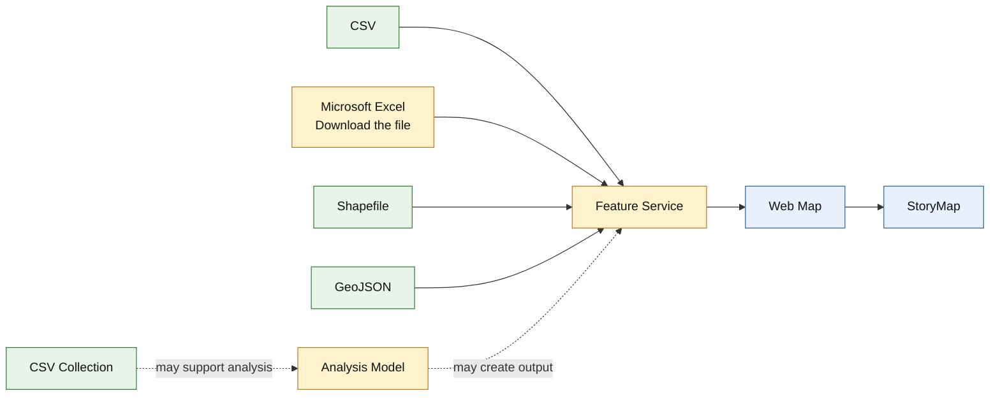

# Transferring ArcGIS Online Content from a DKU Account to a Public Account

[Your Name]

Last updated: September 8, 2026

This tutorial explains how to copy selected ArcGIS Online items from a DKU organizational account to a personal ArcGIS Public Account using [ArcGIS Assistant](https://assistant.esri-ps.com/).

The tutorial is intended for students who want to keep copies of their work before their DKU account becomes unavailable. ArcGIS Assistant is currently in beta, so its interface may change.

- [Before You Start](#before-you-start)
- [Understand What Will Be Copied](#understand-what-will-be-copied)
- [Sign In to ArcGIS Assistant](#sign-in-to-arcgis-assistant)
- [Copy an Item](#copy-an-item)
- [Copy Different Item Types](#copy-different-item-types)
- [Check the Copied Items](#check-the-copied-items)
- [Resources](#resources)

# Before You Start

## What You Need

You will need:

1. Your DKU ArcGIS Online account;
2. A personal [ArcGIS Public Account](https://www.arcgis.com/home/signin.html);
3. Permission to copy the selected content;
4. Enough time to open and test each copied item before your DKU account expires.

> **Important:** Only transfer items that you created or have permission to use. Do not transfer restricted, confidential, licensed, or course-owned data without permission.

## Know the Limits of a Public Account

A free ArcGIS Public Account is designed for personal, noncommercial use. It can store up to 2 GB of content and can create basic maps, scenes, stories, and apps.

However, a Public Account cannot:

- Publish hosted layers;
- Run analysis in Map Viewer;
- Use premium content;
- Create ArcGIS Dashboards or Experience Builder apps;
- Use embed blocks in ArcGIS StoryMaps.

These limitations affect several items in this tutorial:

- A **Microsoft Excel** item should be downloaded and saved as an `.xlsx` file instead of copied to the Public Account;
- An **Analysis Model** cannot be copied to a Public Account;
- A **Feature Service** should be copied **by reference**.

> **What does “Copy by reference” mean?**
>
> Assistant creates a new item in your personal account, but the item continues to use the original service stored in the DKU organization. If the original service is deleted, made private, or becomes unavailable, the referenced layer may stop working.

If you need an independent copy of a hosted layer, use another ArcGIS organizational account with permission to publish hosted layers, or export the data before leaving DKU.

# Understand What Will Be Copied

ArcGIS projects are often made of several connected items. A StoryMap may contain a Web Map, and the Web Map may use one or more Feature Services.

The test content used in this tutorial includes the following item types:

Copy items in this order:

1. Save the original **Microsoft Excel** workbook;
2. Copy **CSV**, **Shapefile**, **GeoJSON**, and **CSV Collection** items;
3. Save a record of the **Analysis Model** if your project uses one;
4. Copy the **Feature Service** by reference;
5. Copy the **Web Map**;
6. Copy the **StoryMap**.

This order makes it easier to find missing data or broken links. It does not guarantee that Assistant will automatically reconnect every copied item.

## What Happens to Each Item Type?

| Item type | What students should expect in a Public Account |
| --- | --- |
| CSV | The file is copied as a separate item. |
| Microsoft Excel | Download and keep the original `.xlsx` file. |
| Shapefile | The zipped shapefile is copied as a separate item. |
| GeoJSON | The GeoJSON file is copied as a separate item. |
| CSV Collection | The collection item can be copied, but it should be opened and checked afterward. |
| Analysis Model | This organization-only item cannot be copied to a Public Account. Save screenshots or notes showing the model settings, or copy it to another organizational account. |
| Feature Service | Select **Copy by reference**. The data remain in the DKU service. |
| Web Map | The map settings are copied, but its layers may still point to DKU services. |
| StoryMap | Text, layout, uploaded media, express maps, and settings are copied. Web Maps, Web Scenes, hosted layers, and linked media remain references. |

# Sign In to ArcGIS Assistant

1. Open [ArcGIS Assistant](https://assistant.esri-ps.com/).

2. Sign in with your **DKU ArcGIS Online account**. This is the source account containing the items you want to copy.

3. Select **My Content**.

4. Click your account icon in the upper-right corner.

5. Check whether your personal ArcGIS account appears under **Recent accounts**.

6. If it does not appear, click **Add ArcGIS Online Account** and sign in with your personal account.

> **Which account should I open first?**
>
> Begin with the account that owns the original items. For this tutorial, begin with your DKU account and choose the personal account later as the copy destination.

> **What if a sign-in window appears?**
>
> Complete the sign-in yourself. If your account uses multifactor authentication, enter the verification code when prompted. Never include passwords or verification codes in tutorial screenshots.

# Copy an Item

The basic copying process is the same for most item types.

1. Under **My Content**, locate the item you want to copy.

2. Check the **Type** column to make sure you selected the correct item. Items can have the same title but different types.

3. Select the checkbox beside the item.

4. Click **Copy Items**.

5. Under **Copy Destination**, select your personal ArcGIS account.

6. Click **Select Account**.

7. Select an existing folder, or click **Create new folder**.

8. Click **Select Folder**.

9. Check the name under **Item Title**. Replace temporary numbers or test words with a short, meaningful title.

For example:

| Test title | Clear title |
| --- | --- |
| `2342423423` | `China Airports Web Map` |
| `China Airport Dataset213123414` | `China Airport Dataset` |
| `Top3_Closest_Airports` | `Top 3 Closest Airports` |
| `China Province Boundaries45345353445` | `China Province Boundaries` |
| `BLM_Event342342423` | `BLM Event Locations` |
| `Chinese_Provinces_With_Over_10_Airports` | `Chinese Provinces With Over 10 Airports` |
| `Provinces_With_Over_10_Airports` | `Provinces With Over 10 Airports Analysis Model` |
| `Mapping China's Airports` | `Mapping China's Airports` |

10. Review any item-specific options shown below the title.

11. Click **Copy Item**.

12. Wait until the message **Copied 1 item** appears.

13. Click **Open in ArcGIS Online** to check the new item.

> **Does “Copied 1 item” mean the entire project was migrated?**
>
> No. It confirms that Assistant created the selected item in the destination account. Related Web Maps, layers, files, and services may still need to be copied and checked separately.

# Copy Different Item Types

## Copy Supported Data Files

Use these steps for **CSV**, **Shapefile**, and **GeoJSON** items.

1. Find the file under **My Content**.

2. Confirm its type in the **Type** column.

3. Select the item and click **Copy Items**.

4. Select your personal account and destination folder.

5. Remove random numbers or test words from **Item Title**.

6. Click **Copy Item**.

7. Open the copied item and look for a **Download** option.

> **Why should I keep the original data file?**
>
> A CSV, shapefile, or GeoJSON file can serve as a backup. If a DKU Feature Service later becomes unavailable, the original file may help you rebuild the layer in an organizational account.

## Save a Microsoft Excel File

A Public Account does not accept a Microsoft Excel item through Assistant. Keep the original workbook instead:

1. Open the **Microsoft Excel** item in your DKU ArcGIS Online account.

2. Click **Download**.

3. Save the `.xlsx` file in a folder you can access after graduation.

If you want the table to appear as an item in your Public Account, save a copy as a CSV file and add the CSV to ArcGIS Online.

## Copy a CSV Collection

1. Locate the **CSV Collection** item.

2. Follow the steps in [Copy an Item](#copy-an-item).

3. Open the copied item and check whether all tables or files in the collection are available.

If part of the collection is missing, copy its original CSV files separately.

## Save a Record of an Analysis Model

An Analysis Model is an organizational-account item, so it cannot be copied to a Public Account. If your project uses one:

1. Open the model in your DKU account.

2. Take a screenshot of the full workflow.

3. Record the names of its input layers, tools, and important settings.

4. Keep these notes with your downloaded data files.

If you later receive access to another ArcGIS organizational account, use the notes to rebuild the model there.

## Copy a Feature Service

1. Locate the item with the type **Feature Service**.

2. Select the item and click **Copy Items**.

3. Select your personal account and destination folder.

4. Review the item title.

5. Select **Copy by reference**.

6. Click **Copy Item**.

> **Is the copied service independent from DKU?**
>
> No. The copied item still points to the original DKU service. Do not use this method as the only backup of important data.

## Copy a Web Map

1. Copy the data files and Feature Services used by the map first.

2. Locate the item with the type **Web Map**.

3. Follow the steps in [Copy an Item](#copy-an-item).

4. Click **Open in ArcGIS Online**.

5. Open the copied map in **Map Viewer**.

6. Check every layer in the **Layers** panel.

> **Why does the copied Web Map open even though I have not copied its data?**
>
> A Web Map stores instructions about how to display layers. It may continue pointing to the original DKU services. The map can open while one or more layers are missing, private, or unavailable.

> **Can I replace a layer URL with any address?**
>
> No. A replacement URL must lead to a working and compatible ArcGIS service. The layer structure, fields, and layer numbers should match the original service. A random URL can break the map.

## Copy a StoryMap

1. Copy and check any Web Maps, Web Scenes, or hosted layers used by the story.

2. Locate the item with the type **StoryMap**.

3. Follow the steps in [Copy an Item](#copy-an-item).

4. Click **Open in ArcGIS Online**.

5. Select **View story**.

6. Check the text, images, maps, and other media from beginning to end.

ArcGIS Assistant copies content stored inside the StoryMap item, including its text, layout, uploaded images, uploaded videos and audio, express maps, and settings.

Web Maps, Web Scenes, hosted layers, embeds, and linked media remain references. Their sharing settings affect whether they can be viewed from the personal account.

> **Why does the StoryMap open immediately after copying?**
>
> The StoryMap item itself has been copied. This does not prove that every map or layer inside it has also been copied. Open the story and test each interactive element.

> **Why is my copied StoryMap private?**
>
> A copied StoryMap is private by default. Check it first. Share or publish it only when you are sure that you have permission to make its content public.

# Check the Copied Items

Complete these checks while you can still access both accounts.

## Check the Personal Account

1. Sign in to [ArcGIS Online](https://www.arcgis.com/) with your personal account.

2. Open **Content**.

3. Confirm that each copied item appears in the correct folder.

4. Check that each title is clear and does not contain temporary numbers or test words.

5. Open every item at least once.

## Check Dependencies

Use this checklist:

- Data files can be downloaded;
- Feature Service items show a working service URL;
- Web Maps open without missing-layer warnings;
- All Web Map layers draw correctly;
- StoryMap text and uploaded media appear;
- Embedded maps inside StoryMaps open correctly;
- The copied items do not request a DKU sign-in unexpectedly.

> **What if the item asks me to sign in to DKU?**
>
> The copied item is probably still referencing private DKU content. Return to the source project, identify the missing Web Map or layer, and copy or export it separately.

# Resources

ArcGIS Online contains many item types and dependencies, and this tutorial covers only the most common situations students may encounter when preserving their work. The following resources provide additional guidance:

- [ArcGIS Assistant User Guide](https://guide.assistant.esri-ps.com/) for inspecting, copying, and modifying ArcGIS items;
- [ArcGIS Assistant Common Workflows](https://guide.assistant.esri-ps.com/docs/common-workflows) for copying StoryMaps and understanding referenced content;
- [Migrating Content Between ArcGIS Online Organizational Accounts](https://sites.psu.edu/psugis/software/migrating-agol-content/) by Penn State for an older ArcGIS Online Assistant workflow;
- [ArcGIS Online Account and Public Account FAQ](https://doc.arcgis.com/en/arcgis-online/reference/faq.htm) by Esri;
- [ArcGIS Online Resources](https://www.esri.com/en-us/arcgis/products/arcgis-online/resources) by Esri;
- [ArcGIS Online Community](https://community.esri.com/t5/arcgis-online/ct-p/arcgis-online) for questions and shared solutions;
- [ArcGIS Assistant Feedback](https://github.com/EsriPS/arcgis-assistant-feedback) for reporting problems with the beta application.

If you have any questions about the tool or this tutorial, do not hesitate to contact the Data and Visualization Librarian, Siti Lei (siti.lei@dukekunshan.edu.cn), for further support.
