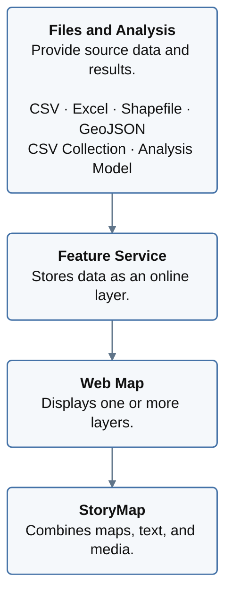
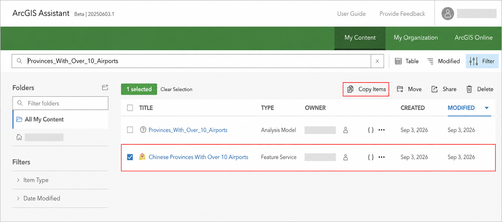
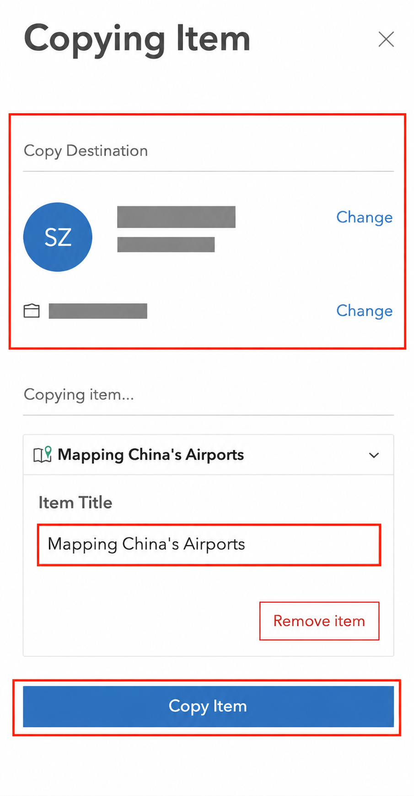
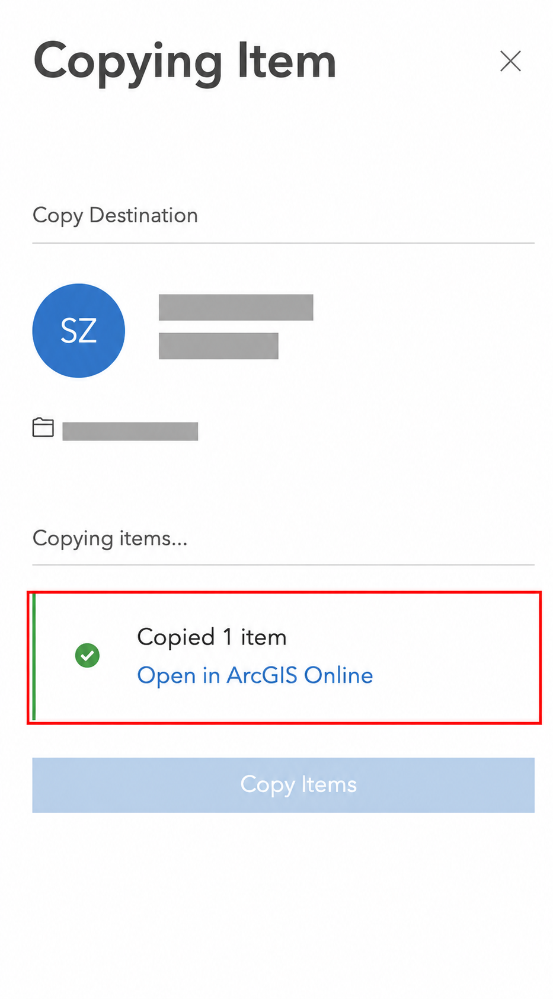
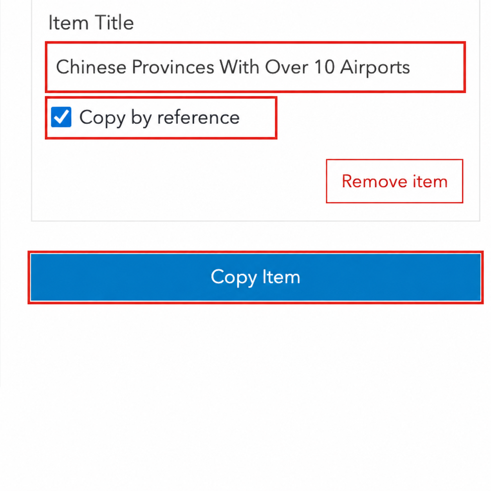

# Transferring ArcGIS Online Content from a DKU Account to a Public Account

[Your Name]

Last updated: September 8, 2026

This tutorial shows how to copy ArcGIS Online content from a DKU organizational account to a personal ArcGIS Public Account using [ArcGIS Assistant](https://assistant.esri-ps.com/). Complete the transfer while you can still open and test the original items.

- [Before You Start](#before-you-start)
- [Understand How ArcGIS Items Are Connected](#understand-how-arcgis-items-are-connected)
- [Sign In to ArcGIS Assistant](#sign-in-to-arcgis-assistant)
- [Copy an Item](#copy-an-item)
- [Copy Different Item Types](#copy-different-item-types)
- [Check the Copied Items](#check-the-copied-items)
- [Resources](#resources)

# Before You Start

You will need:

1. Your DKU ArcGIS Online account;
2. A personal [ArcGIS Public Account](https://www.arcgis.com/home/signin.html);
3. Permission to copy the content.

## Know the Limits of a Public Account

ArcGIS Public Accounts have fewer capabilities than organizational accounts. For the item types in this tutorial:

- **Microsoft Excel:** download and keep the original `.xlsx` file;
- **Analysis Model:** save a record of the workflow;
- **Feature Service:** select **Copy by reference**.

# Understand How ArcGIS Items Are Connected

An ArcGIS project is often a group of connected items, not a single file. The diagram below shows a common project structure.

For migration, begin with the source data and move toward the StoryMap:

1. Download the **Microsoft Excel** workbook;
2. Copy **CSV**, **Shapefile**, **GeoJSON**, and **CSV Collection** items;
3. Save a record of the **Analysis Model**;
4. Copy the **Feature Service** by reference;
5. Copy the **Web Map**;
6. Copy the **StoryMap**.

## What Happens to Each Item Type?

Use this table for a quick check:

- ✅ = copied to your personal account and independent of DKU;
- ⚠️ = copied to your personal account but may still use DKU content;
- ❌ = cannot be copied to a Public Account through Assistant.

| Item type | Can you transfer it? | Is it independent of DKU afterward? |
| --- | --- | --- |
| CSV | ✅ Yes | ✅ Yes. The copied file is stored in your personal account. |
| Microsoft Excel | ❌ Not through Assistant | Download the `.xlsx` file to your computer instead. |
| Shapefile | ✅ Yes | ✅ Yes. The copied zipped file is stored in your personal account. |
| GeoJSON | ✅ Yes | ✅ Yes. The copied file is stored in your personal account. |
| CSV Collection | ✅ Yes | ✅ The copied collection is stored in your personal account. Check its included files after copying. |
| Analysis Model | ❌ No | No model is created in the Public Account. Save screenshots and settings instead. |
| Feature Service | ⚠️ By reference only | ❌ No. The new item is in your account, but the service and data remain in DKU. |
| Web Map | ✅ Yes | ⚠️ Partly. The Web Map is in your account, but its layers may still come from DKU. |
| StoryMap | ✅ Yes | ⚠️ Partly. The StoryMap is in your account, but embedded maps, layers, or linked media may still come from DKU. |

# Sign In to ArcGIS Assistant

1. Open [ArcGIS Assistant](https://assistant.esri-ps.com/).
2. Sign in with your **DKU ArcGIS Online account**.
3. Select **My Content**.
4. Click the account icon in the upper-right corner.
5. If your personal account is not listed under **Recent accounts**, select **Add ArcGIS Online Account**.
6. Sign in with your personal account.

# Copy an Item

Use these steps for most supported item types:

1. Under **My Content**, find the item.
2. Check its name and **Type**.
3. Select the checkbox beside the item.
4. Click **Copy Items**.

5. Under **Copy Destination**, select your personal account.
6. Click **Select Account**.
7. Select a folder and click **Select Folder**.
8. Review the **Item Title**. Replace test words or numbers with a clear title. For example, change `My_Web_Map_Test_123` to `Campus Accessibility Web Map`.
9. Click **Copy Item**.

10. When **Copied 1 item** appears, click **Open in ArcGIS Online**.

The message confirms that the selected item was copied. Copy and check its related files, layers, and maps separately.

# Copy Different Item Types

## CSV, Shapefile, and GeoJSON

1. Copy each file by following [Copy an Item](#copy-an-item).
2. Give each copied item a clear title.
3. Open the copied item.
4. Confirm that the file can be downloaded.

## Microsoft Excel

1. Open the Excel item in your DKU account.
2. Click **Download**.
3. Save the `.xlsx` file.

To add the table to a Public Account, save a copy as CSV and upload the CSV.

## CSV Collection

1. Copy the CSV Collection by following [Copy an Item](#copy-an-item).
2. Open the copied collection.
3. Confirm that its tables and files are available.

## Analysis Model

An Analysis Model cannot be copied to a Public Account.

1. Open the model in your DKU account.
2. Take a screenshot of the workflow.
3. Record its input layers and important settings.

## Feature Service

1. Find the item with the type **Feature Service**.
2. Select it and click **Copy Items**.
3. Select your personal account and folder.
4. Review the title.
5. Select **Copy by reference**.
6. Click **Copy Item**.

**Copy by reference** creates an item in the personal account but keeps the original DKU service URL. In this tutorial, leave the URL unchanged. Update it only when the same layer has been published in another organizational account and has a new service URL.

## Web Map

1. Copy the data files and Feature Services used by the map.
2. Find the item with the type **Web Map**.
3. Copy it by following [Copy an Item](#copy-an-item).
4. Click **Open in ArcGIS Online**.
5. Open the map in **Map Viewer**.
6. Check every layer in the **Layers** panel.

A Web Map stores map settings and links to its layers. It may open while still using Feature Services from the DKU account.

## StoryMap

1. Copy and check the Web Maps and layers used by the story.
2. Find the item with the type **StoryMap**.
3. Copy it by following [Copy an Item](#copy-an-item).
4. Click **Open in ArcGIS Online**.
5. Select **View story**.
6. Check the text, images, maps, and other media.

ArcGIS Assistant copies the StoryMap item. Web Maps, Web Scenes, hosted layers, embeds, and linked media remain connected items and should be checked separately.

# Check the Copied Items

Sign in to [ArcGIS Online](https://www.arcgis.com/) with your personal account and open **Content**. Then confirm that:

- Each copied item appears in the correct folder;
- Item titles are clear;
- Data files can be downloaded;
- Feature Service URLs open;
- Web Map layers display;
- StoryMap text, images, and maps display.

# Resources

ArcGIS Online contains many item types and dependencies, and this tutorial covers only the most common situations students may encounter when preserving their work. The following resources provide additional guidance:

- [ArcGIS Assistant User Guide](https://guide.assistant.esri-ps.com/) for inspecting, copying, and modifying ArcGIS items;
- [ArcGIS Assistant Common Workflows](https://guide.assistant.esri-ps.com/docs/common-workflows) for copying StoryMaps and understanding referenced content;
- [Migrating Content Between ArcGIS Online Organizational Accounts](https://sites.psu.edu/psugis/software/migrating-agol-content/) by Penn State for an older ArcGIS Online Assistant workflow;
- [ArcGIS Online Account and Public Account FAQ](https://doc.arcgis.com/en/arcgis-online/reference/faq.htm) by Esri;
- [ArcGIS Online Resources](https://www.esri.com/en-us/arcgis/products/arcgis-online/resources) by Esri;
- [ArcGIS Online Community](https://community.esri.com/t5/arcgis-online/ct-p/arcgis-online) for questions and shared solutions;
- [ArcGIS Assistant Feedback](https://github.com/EsriPS/arcgis-assistant-feedback) for reporting problems with the beta application.

If you have any questions about the tool or this tutorial, do not hesitate to contact the Data and Visualization Librarian, Siti Lei (siti.lei@dukekunshan.edu.cn), for further support.
